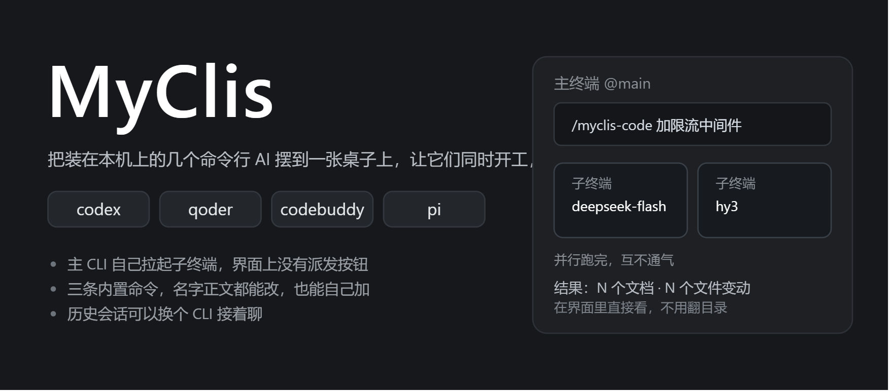
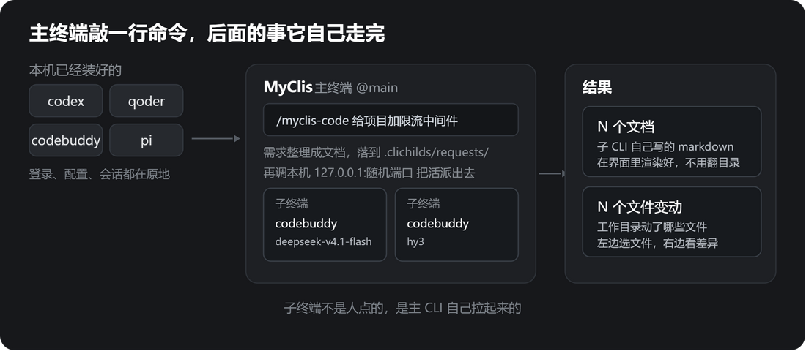
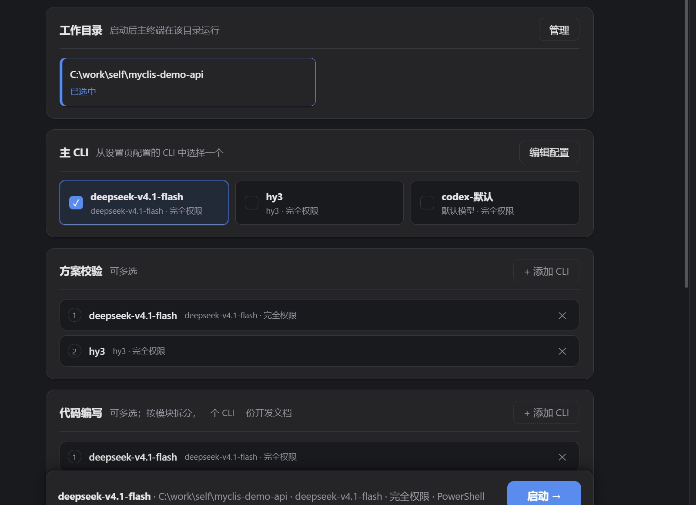
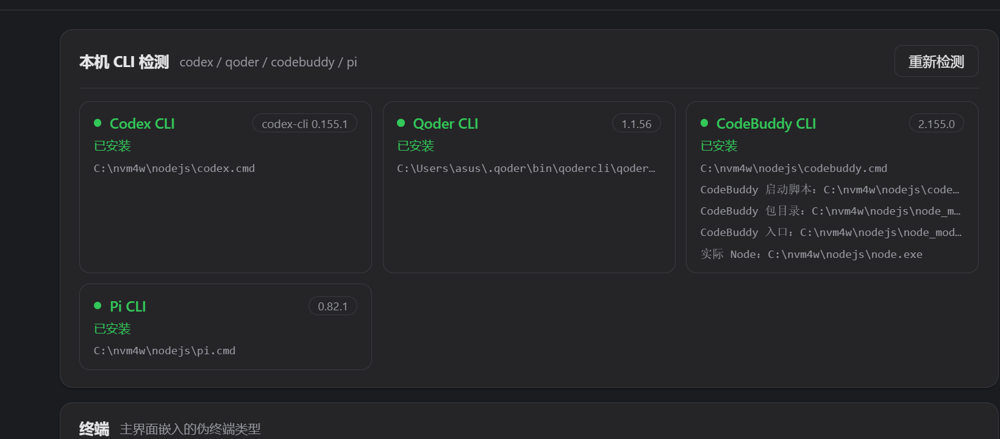
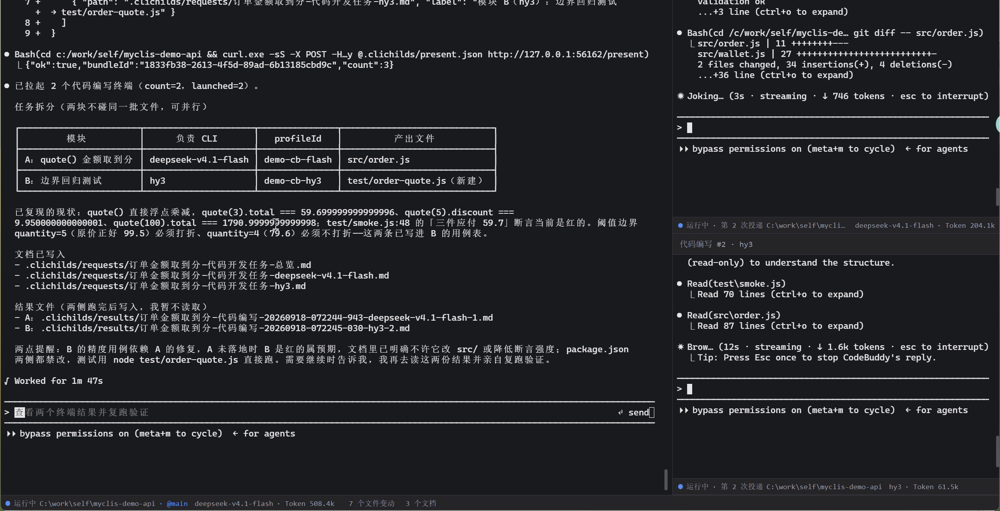

# MyClis

<!-- markdownlint-disable first-line-h1 -->
<!-- markdownlint-disable html -->

  

  
  
  
  
  

## 1. 这是什么

把装在你电脑上的命令行 AI（codex、qoder、codebuddy、pi）收到同一个工作台里。选一个当主 CLI，
它在干活的过程中自己去拉起别的 CLI，并行做方案校验、编码和代码检查以及你任意你自定义的工作流程，结果回到同一个界面看。

## 2. 它核心解决什么

MyClis 通过CLI自主分配任务给任意子CLI，让它们同时开工并收集结果进行分析。自主分配、执行、总结，也能互相接手。

它没有给这些 CLI 加一大堆提示词，所有命令均可以自主设置或选择性执行。

  

## 3. 核心能力

- **聚合多种 CLI。** 支持 codex、qoder、codebuddy、pi。设置页的「本机 CLI 检测」会列出各自是否安装、可执行文件位置和版本号。同一家 CLI 可以建多条档案（换模型、换权限模式），主 CLI 和子终端分别指定用哪一条。
- **主 CLI 自己派活。** 在主终端敲一条斜杠命令，比如 `/myclis-code 给这个项目加一个限流中间件`。主 CLI 先把需求整理成一份文档落到工作目录里，再调本机 127.0.0.1 上的一个随机端口把任务分发出去，右侧随之冒出子终端。这些子终端是主 CLI 自己拉起来的，界面上没有「派发任务」这种按钮。
- **子终端并行。** 每个子任务占右侧一栏，同时跑。同一个 CLI 挂不同模型也能同场并行，比如两条 codebuddy，一条 deepseek-v4.1-flash、一条 hy3，各跑一份、互相不通气。
- **命令能改、能关、能自己加。** 三条内置命令的名字和正文都能改，也能关掉，或者自己新建一条。这一栏改完立刻生效，不用重启。
- **默认注入只加一小段。** 启动主 CLI 时只追加一段很短的输出展示协议，告诉它结果不必只留在终端里，可以发到应用底部给你看。不往系统提示里塞几千字。协议全文在设置页可以展开来看。
- **产出看得见。** 子 CLI 的结果是工作目录里的 markdown 文件，应用底部的输出区直接渲染 markdown 和图片，不用去翻目录。「文件变动」列出这次改动的文件，可以看 diff，统一视图和并排视图随意切。
- **历史会话，可换 CLI 接手。** 每条会话都会记下来。筛选切到「全部」，连各个 CLI 自己的历史都会扫出来，不限于从这个应用启动的。点开某条能看到当时的完整对话；「使用其他 CLI 继续」可以把聊到一半的活交给另一个 CLI 接手，前面聊过的内容整理成文件带过去；想看原始记录，也可以用那个 CLI 自己的 resume 接上。
- **三套皮肤。** 浅色、护眼、深色，随手切。

## 4. 界面

**启动页** —— 选工作目录、选主 CLI，并把方案校验 / 代码编写 / 代码检查分别派给哪些 CLI。

**本机 CLI 检测** —— 设置页会探测本机装了哪些 CLI，能读到版本号的直接列出来。

**工作台** —— 左边主终端，右边是主 CLI 拉起来的子终端，底部两个数字是输出与文件变动的入口。

## 5. 下载与安装

到 [Releases](https://github.com/ShimmerTo/MyClis/releases) 下载，两个包功能一样：

| 文件 | 说明 |
| --- | --- |
| `myclis-setup-<版本>.exe` | 安装版（NSIS），可自选安装目录，会建桌面快捷方式，能卸载 |
| `myclis-portable-<版本>.exe` | 便携版，双击就跑，不用装 |

**NOTE: 需要先自己装好至少一个受支持的 CLI，并且它能在你自己的终端里正常跑起来。**
MyClis 不附带这些 CLI，也不代管它们的账号、额度与登录状态。

## 6. 快速开始

1. 首次打开进引导页，做三件事：选（或新建）一个工作目录、选一个主 CLI、选一套皮肤。
2. 到启动页确认工作目录和主 CLI。需要的话给「方案校验 / 代码编写 / 代码检查」分别指定子 CLI，不指定就不派这一类子任务。
3. 点「启动 →」进工作台，在主终端里敲 `/` 选一条命令，把需求说清楚，回车。
4. 等右侧子终端跑完，点底部的数字看文档和文件变动。

**NOTE: 工作目录是唯一的落盘位置**，生成的文档都写在它的 `.clichilds/` 下。换目录等于换一个工作现场。

## 7. 内置命令

| 命令 | 作用 |
| --- | --- |
| `/myclis-design` | 方案设计与校验 |
| `/myclis-code` | 编码 |
| `/myclis-review` | 代码检查 |

名字和正文都能改，也能关掉，或者自己新建一条。这一栏改完立刻生效，不用重启。

## 8. 许可

本仓库代码以 [Apache-2.0](LICENSE) 授权，允许商业使用、修改与二次分发。

二次分发时请保留 `LICENSE` 全文，并在修改过的文件里注明改动；仓库目前没有 `NOTICE` 文件，
若你分发时新增了 `NOTICE`，需要一并带上其中的署名信息。

## 9. 反馈

遇到问题或想要新功能，直接开 [Issue](https://github.com/ShimmerTo/MyClis/issues)。
